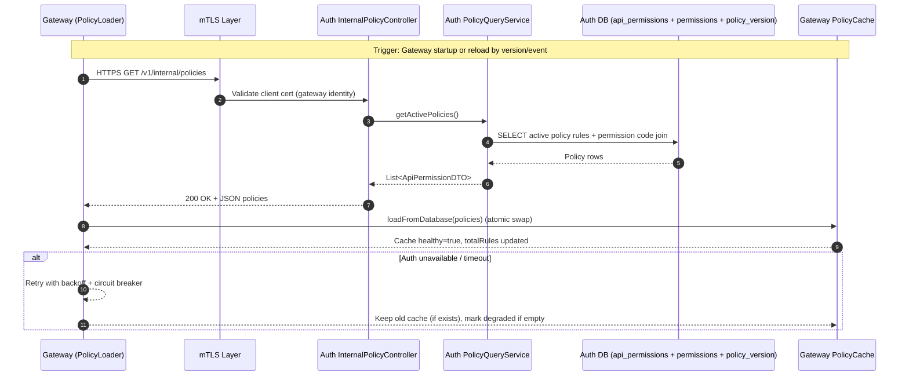

# Internal Policy API

## Purpose
Provide policy snapshot data for `mangala-gateway` authorization cache.

## Endpoints
- `GET /v1/internal/policies`
- `GET /v1/internal/policies/version`

## Response Contracts
### GET /v1/internal/policies
Returns `List<ApiPermissionDTO>` from `org.mangala.security.model.ApiPermissionDTO`.

Example item:
```json
{
  "id": "f56f7df6-4ee6-4f0f-a3a0-f6f45e90ea6d",
  "httpMethod": "GET",
  "pathPattern": "/api/v1/wallets",
  "permissionCode": "wallets:read",
  "conditionExpr": null,
  "serviceName": "wallet-service",
  "priority": 10,
  "active": true
}
```

### GET /v1/internal/policies/version
Returns a single JSON number:
```json
42
```

## Data Source
`GET /v1/internal/policies` query joins:
- `api_permissions`
- `permissions`

Filter:
- `api_permissions.is_active = true`
- `permissions.is_active = true`

Order:
- `priority DESC, path_pattern ASC, http_method ASC`

## Security Model
Security is controlled by:
- `application.security.internal-api.mtls-enabled`
- `application.security.internal-api.subject-principal-regex`
- `application.security.internal-api.allowed-principals`

When `mtls-enabled=true`:
- `/v1/internal/**` requires x509 client certificate authentication.
- Extracted principal must be listed in `allowed-principals`.
- Authorized principal receives `INTERNAL_POLICY_READ` authority to access:
  - `GET /v1/internal/policies`
  - `GET /v1/internal/policies/version`

When `mtls-enabled=false`:
- `/v1/internal/**` is permitted (for local/dev bootstrapping only).

## Sequence

